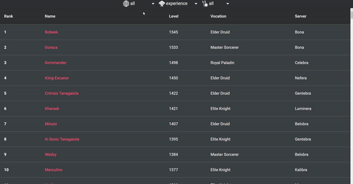

# Tibia Highscores

### NOTE as today (19/07/2020) Vercel ~~broke~~ changed? something and live demo version does not work 🤔 Locally everything is in place 👍

DEMO 👉 https://tibia-highscores.now.sh/



All skill highscores of all vocations from all tibian worlds, written in [Next.js](https://github.com/zeit/next.js/) with data powered by [TibiaData](https://tibiadata.com).

## Prerequisites

Written and tested with [Node.js](https://nodejs.org) version 14.3.0

## Setup

Get the code by either cloning this repository using git

```
git clone https://github.com/auto200/Tibia-Highscores.git
```

... or [downloading source code](https://github.com/auto200/Tibia-Highscores/archive/master.zip) code as a zip archive.

Once downloaded, open the terminal in the project directory, and install dependencies with:

```
npm install
```

Then start the app with:

```
npm run dev
```

The app should now be up and running at http://localhost:3000 🚀
